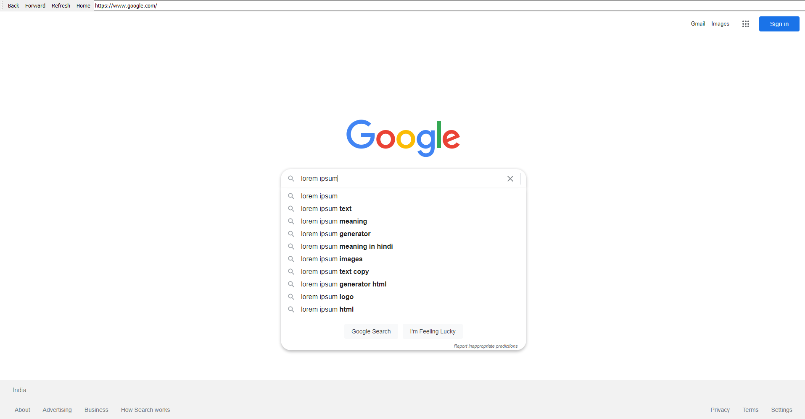

[![Stargazers][stars-shield]][stars-url]
[![Issues][issues-shield]][issues-url]
[![MIT License][license-shield]][license-url]


<!-- PROJECT LOGO -->
<br />
<p align="center">
  <a href="https://github.com/IAmMaulik/Sternet">
    
  </a>

  <h3 align="center">Sternet Browser</h3>

  <p align="center">
    A fully functional web browser made entirely in Python!
    <br />
    <a href="https://github.com/othneildrew/Best-README-Template"><strong>Explore the docs »</strong></a>
    <br />
    <a href="https://github.com/othneildrew/Best-README-Template/issues">Report Bug</a>
    ·
    <a href="https://github.com/othneildrew/Best-README-Template/issues">Request Feature</a>
  </p>
</p>


<!-- TABLE OF CONTENTS -->
<details open="open">
  <summary>Table of Contents</summary>
  <ol>
    <li>
      <a href="#about-the-project">About The Project</a>
      <ul>
        <li><a href="#built-with">Built With</a></li>
      </ul>
    </li>
    <li>
      <a href="#getting-started">Getting Started</a>
      <ul>
        <li><a href="#installation">Installation</a></li>
      </ul>
    </li>
    <li><a href="#contributing">Contributing</a></li>
    <li><a href="#license">License</a></li>
    <li><a href="#contact">Contact</a></li>
    <li><a href="#acknowledgements">Acknowledgements</a></li>
  </ol>
</details>


<!-- ABOUT THE PROJECT -->
## About The Project



The Sternet Wb Browser is the perfect web bowser for you!
Here's why:
* You care about your privacy and don't want your information to be sold
* You want a fully customisable experience with your browser
* You want a browser that is lightweight and fast


### Built With

This browser was made using the Python language and by using the PyQt5 Library
* [PyQt5](https://www.riverbankcomputing.com/static/Docs/PyQt5/)


<!-- GETTING STARTED -->
## Getting Started

To get a local copy up and running follow these simple example steps.

### Installation

1. Clone the repo
   ```sh
   git clone https://github.com/your_username_/Project-Name.git
   ```
2. Install pip packages
   ```sh
   pip install -r requirements.txt
   ```
3. Run the Program
   ```sh
   python3 main.pyw
   ```
Note: If the last command does not work, try
```sh
python main.pyw
````
## Contributing

Contributions are what make the open source community such an amazing place to be learn, inspire, and create. Any contributions you make are **greatly appreciated**.

1. Fork the Project
2. Create your Feature Branch (`git checkout -b feature/AmazingFeature`)
3. Commit your Changes (`git commit -m 'Add some AmazingFeature'`)
4. Push to the Branch (`git push origin feature/AmazingFeature`)
5. Open a Pull Request


<!-- LICENSE -->
## License

Distributed under the MIT License. See `LICENSE` for more information.


<!-- CONTACT -->
## Contact

This project was made by [@IAmMaulik](https://iammaulik.github.io)


<!-- MARKDOWN LINKS & IMAGES -->
<!-- https://www.markdownguide.org/basic-syntax/#reference-style-links -->
[stars-shield]: https://img.shields.io/github/stars/IAmMaulik/Sternet?style=for-the-badge
[stars-url]: https://github.com/IAmMaulik/Sternet/stargazers
[issues-shield]: https://img.shields.io/github/issues/IAmMaulik/Sternet?style=for-the-badge
[issues-url]: https://github.com/IAmMaulik/Sternet/issues
[license-shield]: https://img.shields.io/github/license/IAmMaulik/Sternet?style=for-the-badge
[license-url]: https://github.com/IAmMaulik/Sternet/blob/master/LICENSE
[product-screenshot]: images/screenshot.png
